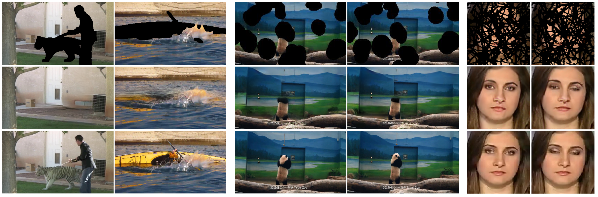
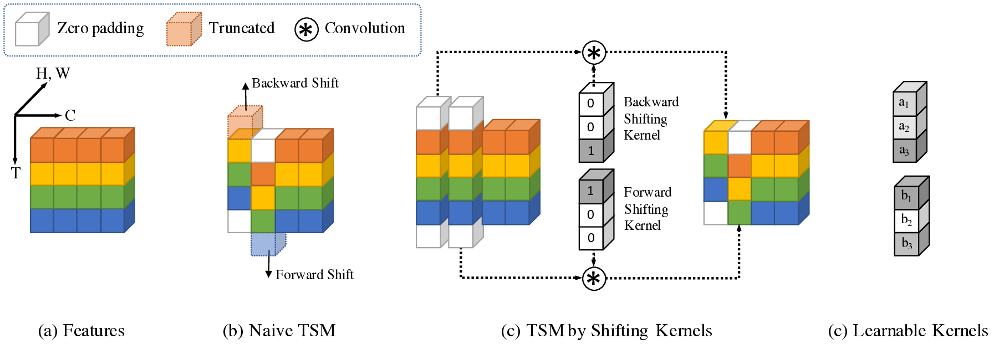
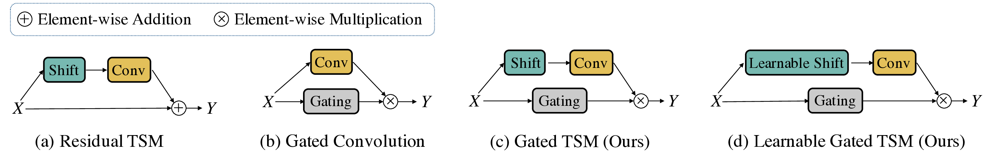
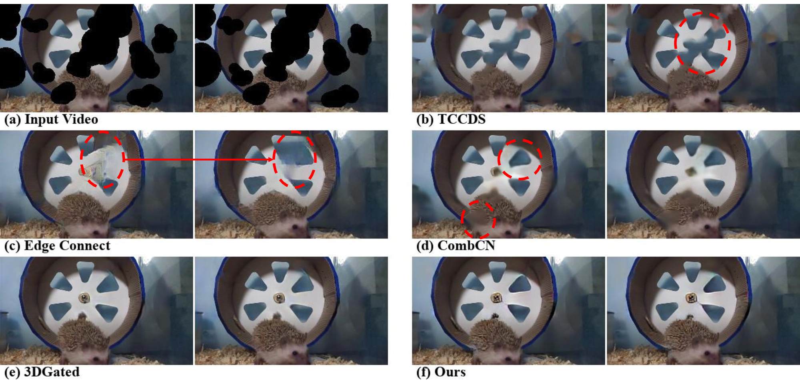
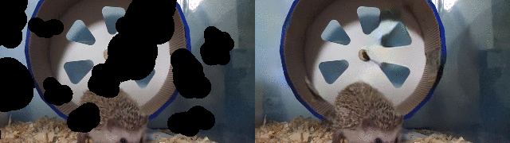
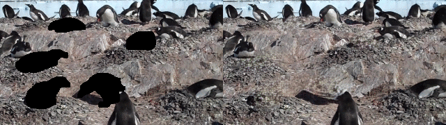

# Learnable Gated Temporal Shift Module for Deep Video Inpainting

Official Pytorch implementation of "Learnable Gated Temporal Shift Module for Deep Video Inpainting. Chang et al. BMVC 2019." [arXiv](https://arxiv.org/abs/1907.01131)

This repository also includes the implementation of some baselines and the Free-form Video Inpainting (FVI) dataset in "Free-form Video Inpainting with 3D Gated Convolution and Temporal PatchGAN. Chang et al. arXiv 2019." [arXiv](https://arxiv.org/abs/1904.10247)



See YouTube [video demo](https://www.youtube.com/watch?v=87Vh1HDBjD0&list=PLPoVtv-xp_dL5uckIzz1PKwNjg1yI0I94&index=32&t=0s) or full resolution videos on [Google Drive](https://drive.google.com/open?id=1sT_ov_lLhQlXE2PnBKCUGOTNz5f_p9G7)

## Introduction

In "Free-form Video Inpainting with 3D Gated Convolution and Temporal PatchGAN. Chang et al. arXiv 2019.", we proposed 3D gated convolutions, Temporal PatchGAN and mask video generation algorithm to deal with free-form video inpainting in an end-to-end way. It is the first deep method for free-form video inpainting and achieves state-of-the-art performance both quantitatively and qualitatively. However, there are too many parameters for 3D gated convolutions and it takes long to train and inference.

Therefore, in "Learnable Gated Temporal Shift Module for Deep Video Inpainting. Chang et al. BMVC 2019.", we proposed a new LGTSM based on temporal shift module (TSM) for action recognition to reduce model parameters and training time to about 33%. The performance is almost the same as our previous work.






This repository contains source code for both works. Some pretrained weights for the GTSM one are given, while the LGTSM code could be found in the LGTSM branch. The pretrained weights of the 3DGated model is not available now due to some compatibility issues. The implementation of the baseline CombCN is also provided.


## Environment Setup
```
git clone git@github.com:amjltc295/Free-Form-Video-Inpainting.git
cd Free-Form-Video-Inpainting
git submodule update --init --recursive
conda env create -f environment.yaml
source activate free_form_video_inpainting
```

## Training
Please see [training](doc/training.md)

## Testing
1. Download corresponding pretrained weights from [Google Drive](https://drive.google.com/open?id=1uva9yI8yYKivqi4pWcyZLcCdIt1k-LRY)
2. Update parameters in `src/other_configs/inference_example.json`:
    * If you want to test on other data, set `root_masks_dir` for testing masks and `root_videos_dir` for testing frames.
    * If you want to turn on evaluation, set `evaluate_score` to `true`.
3. Run
```
python train.py -r <pretrained_weight_path> --dataset_config other_configs/inference_example.json -od test_outputs
```

Then, you should have a directory src/test_outputs/ like:
```
test_outputs
└── epoch_0
    ├── test_object_like
    │   ├── inputs
    │   │   └── input_0000
    │   └── result_0000
    └── test_object_removal
        ├── inputs
        │   └── input_0000
        └── result_0000
```
The following GIFs show the figures that will appear in

(top row) `test_object_like/result_0000`, `test_object_like/inputs/result_0000`,

(bottom row) `test_object_removal/result_0000`, `test_object_removal/inputs/result_0000`



 

## License
**This repository is limited to research purpose.** For any commercial usage, please contact us.

## Authors

Ya-Liang Chang (Allen) [amjltc295](https://github.com/amjltc295/) yaliangchang@cmlab.csie.ntu.edu.tw

Zhe-Yu Liu [Nash2325138](https://github.com/Nash2325138) zhe2325138@cmlab.csie.ntu.edu.tw


Please cite our papers if you use this repo in your research:
```
@article{chang2019free,
  title={Free-form Video Inpainting with 3D Gated Convolution and Temporal PatchGAN},
  author={Chang, Ya-Liang and Liu, Zhe Yu and Lee, Kuan-Ying and Hsu, Winston},
  journal={arXiv preprint arXiv:1904.10247},
  year={2019}
}
@article{chang2019learnable,
  title={Learnable Gated Temporal Shift Module for Deep Video Inpainting"},
  author={Chang, Ya-Liang and Liu, Zhe Yu and Lee, Kuan-Ying and Hsu, Winston},
  journal={BMVC},
  year={2019}
}
```
## Acknowledgement
This work was supported in part by the Ministry of Science and Technology, Taiwan, under
Grant MOST 108-2634-F-002-004. We also benefit from the NVIDIA grants and the DGX-1
AI Supercomputer. We are grateful to the National Center for High-performance Computing.
